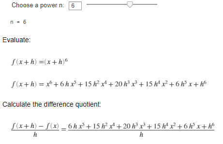
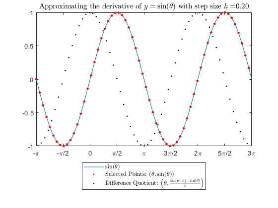
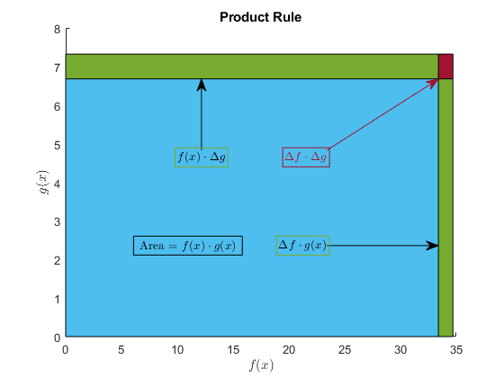
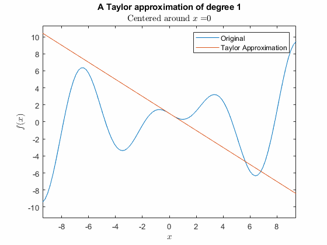
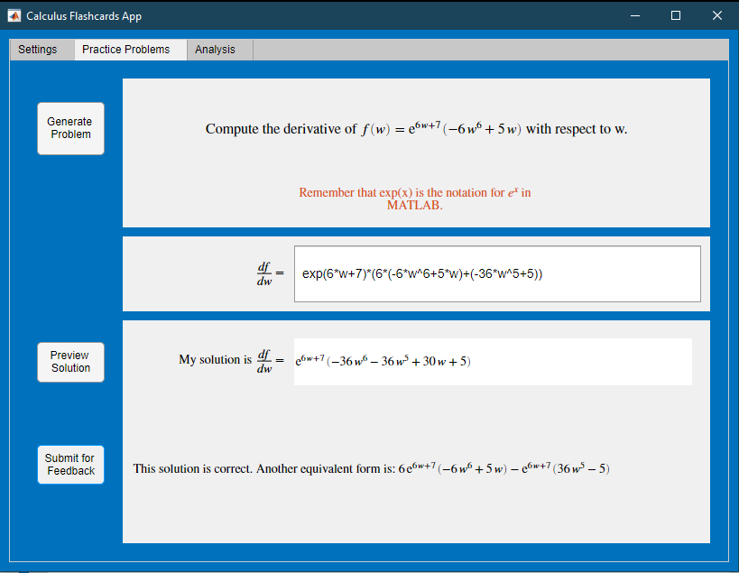
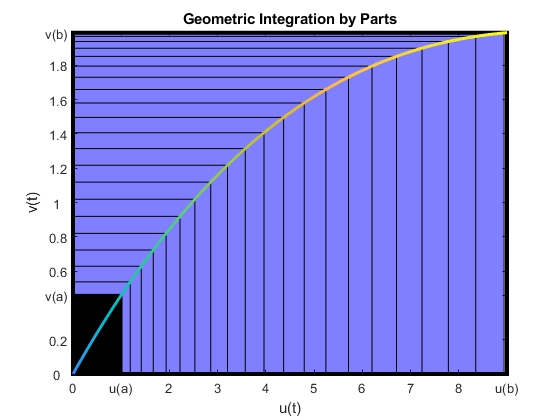

# Calculus: Derivatives

 or 

**Curriculum Module**

_Created with R2021a. Compatible with R2021a and later releases._

# Information

This curriculum module contains interactive [MATLAB® live scripts](https://www.mathworks.com/products/matlab/live-editor.html) that teach fundamental concepts and basic terminology related to derivative calculus. There is a focus on numerical approximation and graphical representation as tools for understanding the concepts of calculus. 

## Background

You can use these live scripts as demonstrations in lectures, class activities, or interactive assignments outside of class. The derivatives module is divided into five scripts and a practice app. The first covers the limit definition of the derivative and includes several motivating examples for the study of derivatives. The second covers derivatives of powers and the linearity of derivatives working from the limit definition of the derivative, including an application to parabolic motion. The third covers derivatives of exponentials, natural logarithms, sines and cosines as well as discussing higher order derivatives. Applications include population growth and oscillatory behavior. The fourth script presents visualizations of the product and chain rule for derivatives as well as randomly generated practice problems. Applications include related rates and the quotient rule for derivatives. The fifth script presents approximation of differentiable functions by polynomials, including tangent lines, and leading up to Taylor polynomials. The Calculus Flashcards app allows users to select the types of derivative (or integral) rules they wish to practice, generate randomized problems, and track their progress within a session.

The instructions inside the live scripts will guide you through the exercises and activities. All interactive exercises offer feedback while reflection questions are more open\-ended and do not include solutions in this module. Get started with each live script by running it one section at a time. To stop running the script or a section midway (for example, when an animation is in progress), use the  **Stop** button in the **RUN** section of the **Live Editor** tab in the MATLAB Toolstrip.

## Contact Us

Solutions are available upon instructor request. Contact the [MathWorks teaching resources team](mailto:onlineteaching@mathworks.com) if you would like to request solutions, provide feedback, or if you have a question.

## Prerequisites

Mathematically, this module assumes a knowledge of functions that is standard in precalculus course materials regarding powers, exponentials, absolute values, logarithms, sines, cosines, rational functions, and asymptotes. In addition, this module assumes basic fluency with limits in discussing the limit definition of the derivative.

Minimal MATLAB fluency is required to use this module; primarily it is standard calculator\-type mathematics such as using `\`* for multiplication and `/` for division. For commands that go beyond interacting with a calculator, the necessary knowledge is included in the module. If you want to improve your MATLAB knowledge, [MATLAB Onramp](https://matlabacademy.mathworks.com/details/matlab-onramp/gettingstarted) is a free two\-hour introductory tutorial that teaches the essentials of MATLAB. 

## Getting Started
### Accessing the Module
### **On MATLAB Online:**

Use the  link to download the module. You will be prompted to log in or create a MathWorks account. The project will be loaded, and you will see an app with several navigation options to get you started.

### **On Desktop:**

Download or clone this repository. Open MATLAB, navigate to the folder containing these scripts and double\-click on [Derivatives.prj](https://matlab.mathworks.com/open/github/v1?repo=MathWorks-Teaching-Resources/Calculus-Derivatives&project=Derivatives.prj). It will add the appropriate files to your MATLAB path and open an app that asks you where you would like to start. 

Ensure you have all the required products (listed below) installed. If you need to include a product, add it using the Add\-On Explorer. To install an add\-on, go to the **Home** tab and select   **Add-Ons** > **Get Add-Ons**. 

## Products

MATLAB®  and the Symbolic Math Toobox™ are used throughout. Tools from the Curve Fitting Toolbox™ are used in `TranscendentalsRules.mlx`.

# Scripts

## [The Definition of the Derivative](https://matlab.mathworks.com/open/github/v1?repo=MathWorks-Teaching-Resources/Calculus-Derivatives&project=Derivatives.prj&file=Definition.mlx)
| **`Definition.mlx`** | **In this script, students will...**  |
| :-- | :-- |
|  | -  explain the limit definition of the derivative and its relationship to secant lines.  -  identify the sign of the derivative at a point as positive, negative, or zero based on the graph of a function.  -  identify points where the derivative of a continuous function does not exist and explain why with reference to the definition of the derivative.  -  recognize $f^{\prime } (x)$ , $\frac{\textrm{d}f}{\textrm{d}x}$ , and $\frac{\textrm{d}}{\textrm{d}x}\left\lbrack f(x)\right\rbrack$ as equivalent notation for the derivative of $f$ with respect to $x$ .  |

## [Derivatives of Polynomials](https://matlab.mathworks.com/open/github/v1?repo=MathWorks-Teaching-Resources/Calculus-Derivatives&project=Derivatives.prj&file=PowerRules.mlx)
| **`PowerRules.mlx`** | **In this script, students will...**  |
| :-- | :-- |
|  | -  explain why the limit definition of the derivative results in the power rule for derivatives.  -  compute the derivatives of linear combinations of powers by hand.  -  apply derivatives to solve practical questions.  |

## [Derivatives of Transcendental Functions](https://matlab.mathworks.com/open/github/v1?repo=MathWorks-Teaching-Resources/Calculus-Derivatives&project=Derivatives.prj&file=TranscendentalsRules.mlx)
| **`TranscendentalsRules.mlx`** | **In this script, students will...**  |
| :-- | :-- |
|  | -  determine the functional relationship of the derivatives of sines, cosines, exponentials, and natural logarithms.  -  explain the pattern in the derivatives of $\sin (ax)$ , $\cos (ax)$ , and $\exp (ax)$ for constant values of $a$ and that the derivative of $\ln (ax)$ does not fit the simple pattern.  -  apply the correct units to derivatives of any order.  -  explore simple first\- and second\-order differential equations that describe a physical system and use them to create mathematical models of the system.  |

## [Chain Rule and Product Rule](https://matlab.mathworks.com/open/github/v1?repo=MathWorks-Teaching-Resources/Calculus-Derivatives&project=Derivatives.prj&file=TranscendentalsRules.mlx)
| **`CombinationRules.mlx`** | **In this script, students will...**  |
| :-- | :-- |
|  | -  explain why the chain rule is $\frac{\textrm{d}}{\textrm{d}x}\left\lbrack f(g(x))\right\rbrack =f^{\prime } (g(x))*g^{\prime } (x)$ .  -  apply the chain rule to calculate derivatives.  -  explain why the product rule is $\frac{\textrm{d}}{\textrm{d}x}\left\lbrack f(x)\cdot g(x)\right\rbrack =f(x)\cdot \frac{\textrm{d}g}{\textrm{d}x}+\frac{\textrm{d}f}{\textrm{d}x}\cdot g(x)$ .  -  apply the product rule to calculate derivatives.  -  practice fluently recognizing and applying the rules for computing derivatives.  |

## [Taylor Polynomials](https://matlab.mathworks.com/open/github/v1?repo=MathWorks-Teaching-Resources/Calculus-Derivatives&project=Derivatives.prj&file=TaylorPolynomials.mlx)
| **`TaylorPolynomials.mlx`** | **In this script, students will...**  |
| :-- | :-- |
|  | -  compute tangent lines.  -  compute quadratic approximations.  -  compute higher order polynomial approximations.  |

# App: [Calculus Flashcards App](https://matlab.mathworks.com/open/github/v1?repo=MathWorks-Teaching-Resources/Calculus-Derivatives&project=Derivatives.prj&file=CalculusFlashcards)

Practice recognizing and solving standard computational problems in calculus.

# License

The license for this module is available in the [LICENSE.md](https://github.com/MathWorks-Teaching-Resources/Calculus-Derivatives/blob/release/LICENSE.md).

# Related Courseware Modules
| **Courseware Module** | **Sample Content** | **Available on:**  |
| :-- | :-- | :-- |
| [**Calculus: Integrals**](https://www.mathworks.com/matlabcentral/fileexchange/105740-calculus-integrals) |  | \href\href{http [GitHub](https://github.com/MathWorks-Teaching-Resources/Calculus-Integrals)   |
| [**Fourier Analysis**](https://www.mathworks.com/matlabcentral/fileexchange/106725-fourier-analysis) |  | \href{https://w\href{https://matlab[GitHub](https://github.com/MathWorks-Teaching-Resources/Fourier-Analysis)  |
|  [**Numerical Methods with Applications**](https://www.mathworks.com/matlabcentral/fileexchange/111490-numerical-methods-with-applications) | ! [image_15.png](Images/image_15.png) | \href{https://www.mathwor [! [OpenInFX.png](Images/OpenInFX.png)](/matlabcentral/fileexchange/111490-numerical-methods-with-applications)\href{https://matlab.mathworks [! [OpenInMO.png](https://www.mathworks.com/images/responsive/global/open-in-matlab-online.svg)](pen/github/v1?repo=MathWorks-Teaching-Resources/Numerical-Methods-with-Applications | project=NumericalMethods.prj)   [GitHub](https://github.com/MathWorks-Teaching-Resources/Numerical-Methods-with-Applications)   |

Or feel free to explore our other [modular courseware content](https://www.mathworks.com/matlabcentral/fileexchange/?q=tag%3A%22courseware+module%22&sort=downloads_desc_30d).

# Educator Resources
-  [Educator Page](https://www.mathworks.com/academia/educators.html) 

# Contribute 

Looking for more? Find an issue? Have a suggestion? Please contact the [MathWorks teaching resources team](mailto:%20onlineteaching@mathworks.com). If you want to contribute directly to this project, you can find information about how to do so in the [CONTRIBUTING.md](https://github.com/MathWorks-Teaching-Resources/Calculus-Derivatives/blob/release/CONTRIBUTING.md)  page on GitHub.

 *©* Copyright 2023 The MathWorks™, Inc

